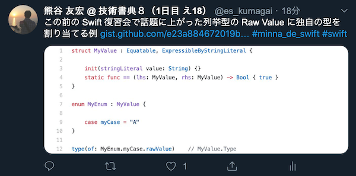
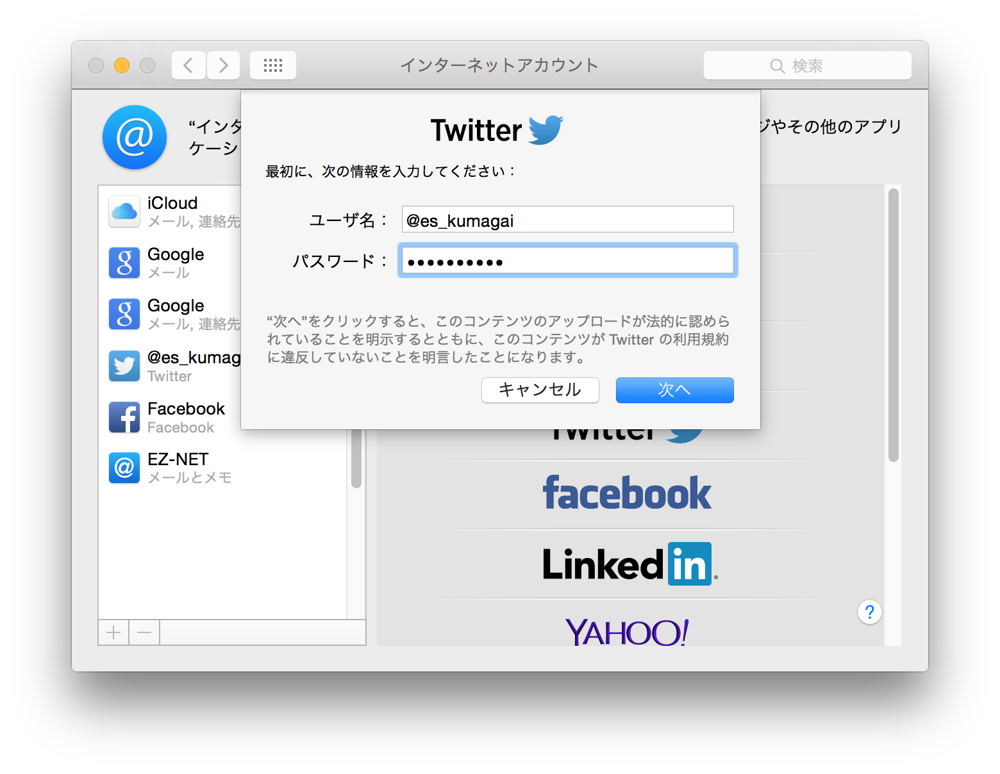
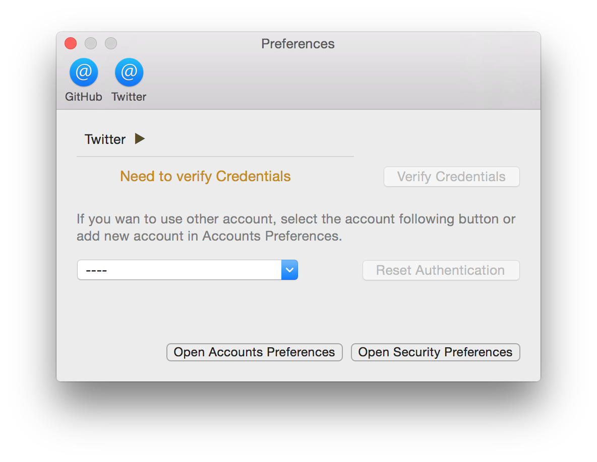

<div style="float: left; text-align: center;">
<a href="https://itunes.apple.com/jp/app/codepiece/id1021284423?mt=12"></a>
<br/>
<a href="https://itunes.apple.com/jp/app/codepiece/id1021284423?mt=12"></a>
</div>

<div style="padding-left: 160px; padding-top: 0pt;">
<h1>CodePiece</h1>

<p>
入力したコードとコメントを Gists へ投稿してリンクをツイートするアプリです。プログラミングの勉強会でコードを添えて呟くのに重宝するかもしれません。
</p>

> GitHub で公開しているものは beta 版です。正式リリースは Mac App Store で行っています。

</div>

<br clear="all"/>

---


# CodePiece で出来ること

## コードを添えてツイートできる

CodePiece アプリにコードを入力して、コメントを添えて投稿すると、その内容が [Gists](https://gist.github.com/) に投稿されて、そのリンクと画像サムネイルを添えたツイートが [Twitter](https://twitter.com/) に投稿されます。



## コードを添えず、普通にツイートできる

コードを入力しなければ、普通にツイートを [Twitter](https://twitter.com/) に投稿できます。

指定してあるハッシュタグも添えられるので、プログラミングの勉強会でコードを添える必要がないときでも CodePiece から普通にツイートできます。

ハッシュタグは投稿した後も入力欄に残されるので、投稿するたびに入力し直す必要がありません。
あらかじめハッシュタグが設定されている勉強会などで設定しておくと、気軽にツイートできます。

## ハッシュタグのツイートが見られる

ハッシュタグを設定しておくと、右側にそのハッシュタグを持つツイートが表示されます。勉強会など、関連するツイートを追いながら、思い思いにツイートしたい時に便利です。

# CodePiece を使うために必要なもの

CodePiece を利用するには、次の環境が必要になります。

* Mac OS X 10.10 以上
* GitHub アカウント
* Twitter アカウント

# CodePiece のセットアップ

## Twitter アカウントを登録する

Twitter アカウントは Mac の環境設定にある ```インターネットアカウント``` 設定で行います。



ここに CodePiece で使いたいツイッターアカウントを登録してください。複数のアカウントを登録した場合はその中のどれかを CodePiece で選択して使います。

## アプリをインストールする

アプリ本体 ```CodePiece.app``` を /Applications フォルダーに保存してください。


> 保存するフォルダーは /Applications でなくても構いません。

## GitHub アカウントを登録する

GitHub アカウントは CodePiece アプリを起動してから、環境設定で行います。

システムメニューの ```CodePiece``` → ```Preferences...``` を選択すると、設定画面が表示されます。この上側のメニューバーで ```GitHub``` を選択すると、GitHub の設定画面が表示されます。


ここの  ```Authentication``` ボタンをクリックすると、既定のブラウザーで GitHub の認証ページが開かれます。そこで GitHub アカウントを使って認証すると CodePiece でそのアカウントが利用できるようになります。

> * 認証には OAuth2 を使用します。アクセストークンが取得され、それがアプリ内に記録されます。
> * OAuth2 認証では Gist を作成する権限だけを取得します。
> * アクセストークンは Keychain に保存されます。

## Twitter アカウントを登録する

Mac に登録されている Twitter アカウントが複数ある場合は、CodePiece で使用する Twitter アカウントを選択する必要が有ります。

CodePiece アプリを起動したら、システムメニューの ```CodePiece``` → ```Preferences...``` を選択すると、設定画面が表示されます。この上側のメニューバーで ```Twitter``` を選択すると、GitHub の設定画面が表示されます。



ここにあるプルダウンメニューから Twitter アカウントを選択することで、そのアカウントを使って CodePiece からコードやつぶやきをツイートできるようになります。

> * Mac に Twitter アカウントがひとつだけしか登録されていない場合は、それが CodePiece でも使用されます。
> * Mac で CodePiece から Twitter アカウントを利用する許可が与えられている必要があります。許可の設定は Mac のシステム環境設定にある ```セキュリティとプライバシー``` で行えます。

