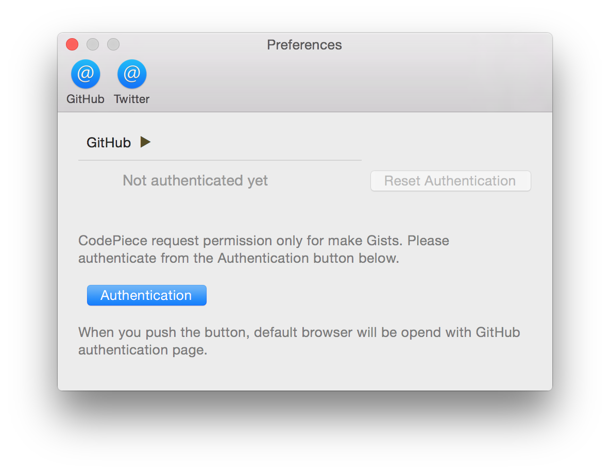

# CodePiece

勉強会で役立つかもしれない、入力したコードとコメントを Gists へ投稿してリンクをツイートするアプリです。


## 必要なもの

* Mac OS X 10.10 以上
* GitHub アカウント
* Twitter アカウント

## 投稿のされ方

CodePiece アプリの ```Code``` 欄に入力されたコードを Gists に投稿し、そのリンクを Twitter に投稿します。Gist の Description と Twitter のメッセージには ```Tweet & Description``` に入力した内容が使われます。このとき ```Hashtag``` に設定したタグも追加されます。

今のところ、入力されたコードは全て ```swift``` で書かれたものとして投稿します。

# セットアップ

## アプリ

アプリ本体 ```CodePiece.app``` を /Applications フォルダーに保存してください。

> 保存するフォルダーは /Applications でなくても構いません。

## Twitter アカウント

Twitter アカウントは Mac の環境設定にある ```インターネットアカウント``` 設定で行います。


ここにツイッターアカウントを登録してください。複数のアカウントが登録されている場合は、いちばん上に登録されているものが使われるはずです。

> CodePiece アプリ起動中にアカウント設定を行った場合は、設定後に CodePiece アプリを再起動してください。

## GitHub アカウント

GitHub アカウントは CodePiece アプリを起動してから、環境設定で行います。

システムメニューの ```CodePiece``` → ```Preferences...``` を選択すると、設定画面が起動するので、そこの ```Authentication``` ボタンをクリックすると認証画面が表示されます。



ここで GitHub のアカウントを入力して ```Authenticate``` ボタンをクリックすると、認証が行われます。

認証時は ```ユーザー名``` と ```パスワード``` を使って GitHub の ```アクセストークン``` を取得します。アプリ内には ```ユーザー名``` と ```アクセストークン``` を Keychain で保存されます。

# 既知の不具合

* ツイート時に Gists のキャプチャを取得できずにアプリが強制終了する場合があります。
* その他、おそらくマルチスレッド処理まわりで強制終了する可能性がある様子です。
* アプリを起動したまま OS X をスリープすると、次回起動時に CodePiece を再起動する必要があります。
* Twitter アカウントが OS X に登録されていないと、現在はアプリ起動時に "Failed to verify credentials" メッセージが表示されます。 (Error Domain=STTwitterOS Code=3 "No Twitter account available." (nil)
* GitHub トークンを iCloud キーチェーンに保存したいところですが、現在は実現できていません。
