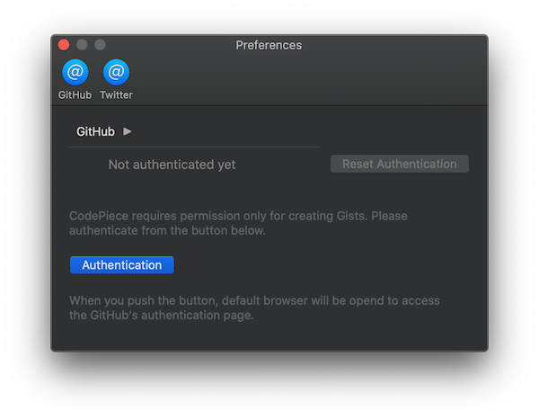
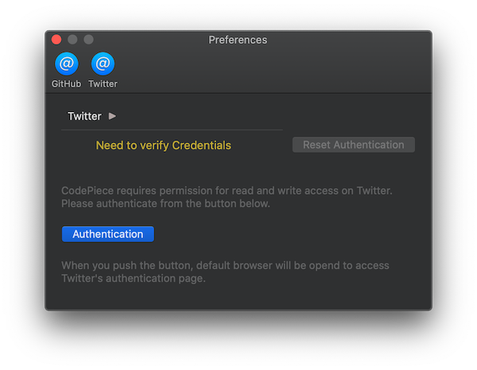

 

<h1>CodePiece</h1>

This is an application that <strong>program codes</strong> and description post to <strong>gist</strong>, then post the link and the capture image to <strong>Twitter</strong>. It may be used to discussion of programming meetup on Twitter.

 

---

# What the app can do

## Post tweet with Source Code

By type codes by the CodePiece and type description, you can **post** the codes to [Gists](https://gist.github.com/), then the **gist link and the thumbnail** are posted to [Twitter](https://twitter.com/).

## Also post tweet without codes

If you don't type program codes, you **can post** tweet to [Twitter](https://twitter.com/) **normally** too.
In this time, post tweet adding entered **hashtags**, so you can use the CodePiece in daily use when you don't need to add a program code.

## Keeping Hashtags

Entered **hashtags are kept** after post, so you don't warry about forgetting adding hashtags. It's very useful in an event where you post some tweets using the same hashtags; for example a programming meetup.

In addition, you can enter **more than one hashtags** too. It is good at tweet with two or more hashtags continuously.

## Show timeline of entered hashtags.

You can always **see the tweets** searched with entered hashtags.
To enter hashtags for tweet, The CodePiece app **query** the tweet with, and **show** the tweets on right side area.It is useful to **do tweeting** something **while watching** tweets about entered hashtags.

# Required

The following environment is required to use the CodePiece app.

* macOS X 10.15 or greater
* GitHub account
* Twitter account

# How to setup

## Install the CodePiece

Store the App `CodePiece.app` to `/Applications` folder or `~/Applications` folder, or other folder as you like.

## Register GitHub account

To post gist, you have to register a GitHub account on the app's preference pane in the CodePiece app.

To select `CodePiece` → `Preferences...` on the system menu, 
you can see the CodePiece app's preference window.
On the preference window, select `GitHub` on the menu bar.

Push the `Authentication` button, then default browser will be launched and show the authorization page of GitHub. To authorizing with your GitHub account in the page, you are able to post gists using the CodePiece.

## Register Twitter account

To post tweet, you have to register a Twitter account like registering a GitHub account.

In the CodePiece's preference window, to push `Twitter` button, you can see the preference pane for registering twitter account.

Push the `Authentication` button, then default browser will be launched and show the authorization page of Twitter. To authorizing with your Twitter account in the page, you are able to tweet using the CodePiece.

